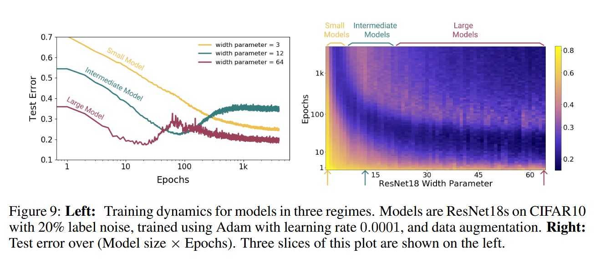

# Deep Double Descent: Where Bigger Models and More Data hurt

## Introduction

经典的统计学习理论中 *bias-variance trade-off* 认为模型复杂度越高，偏差越低但方差会越高。 根据该理论，一旦模型复杂度超过一定阈值，模型就会 “过拟合”，由方差项主导测试误差。因此从这点之后，增加模型复杂度枝会降低性能。

> 偏差（bias）：用于简化模型来近似真实世界问题（可能很复杂）引入的误差。高偏差意味着模型对数据做出了强烈的假设，导致欠拟合，即模型无法捕捉数据中的底层模式。
>
> 方差（variance）：模型对训练数据中小变化的敏感性导致的误差。高方差意味着模型将训练集中的噪声或随机波动视为真实模式，导致过拟合，即模型在训练数据上表现好，但在新数据上表现差。

因此经典统计学中传统观点是，“once we pass a certrain threshole, larger models are worse”。

而神经网络具有数百万个参数，甚至足以适应随机标签，但它们在许多任务上的表现要比较小的模型好得很多。相关人员的观点是 “larger models are better”。

神经网络中训练时间对测试性能的影响存在争议，在某些情况下，“提前停止” 可以提高测试性能。而在其他情况下，将神经网络训练到零训练误差可以提高性能。但经典统计学家和深度学习实践者都同意 “more data is always better”。

**main contributions**：
- 双重下降（double descent）在不同任务、模型架构及优化方式下是一种稳健的现象。

- 提出用训练中的 **EMC**(*effective model complexity*) 来替代参数量，即给定一个数据分布和小误差阈值，EMC 是在给定训练过程能使平均训练误差小于误差阈值的最大样本数。因为 EMC 不仅取决于数据分布、分类器架构，还取决于训练过程，尤其是训练时间增加会增加 EMC。

- 我们假设对许多模型和学习算法，双重下降是 EMC 的函数。若固定模型，增加训练时间，会观察到性能遵循 "epoch-wise double descent"。在欠拟合阶段（EMC 小于样本数量时），性能遵循经典的 U 型曲线；当 EMC 足够大于样本数量时，性能随着训练时间的推移而提高。作为推论，早停知对

- 我们结果展示了测试性能作为训练样本数量的函数。由于测试误差在 EMC 与样本数量匹配的点附近达到峰值（从参数化不足到参数化过度2的过渡），增加样本数量会使该峰值向右移动。在一些特殊情况下会出现数据越多，性能越差的现象。

## Our Results

先给出 *effective model complexity* 准确定义：

**Definition1 (Effective Model Complexity)**: The Effective Model Complexity(EMC) of a training procedure $\mathcal{T}$, with respect to distribution $\mathcal{D}$ and parameter $\epsilon > 0$, is defined as :
 
$$
 EMC_{\mathcal{D}, \epsilon} (\mathcal{T}) := \max    \{ n | \mathbb{E}_{S \sim \mathcal{D}^n} \left[ Error_S(\mathcal{T}(S)) \right] \leq \epsilon  \}
$$
 
再非正式表述主要假设：

**Hypothesis 1 (Generalized Double Descent hypothesis, informal)**: For any natural data distribution $\mathcal{D}$, neural-network-based training procedure $\mathcal{T}$ , and small $\epsilon > 0 $, if we consider the task of predicting labels based on n samples from $\mathcal{D}$ then:

**Under-paremeterized regime**: If $EMC_{\mathcal{D}, \epsilon} (T)$ is sufficiently smaller than n, any perturbation of \mathcal{T} that increases its effective complexity will decrease the test error.

**Over-parameterized regime**: If $EMC_{\mathcal{D} , \epsilon} (T)$ is sufficiently larger than n, any perturbation of T that increases its effective complexity will decrease the test error.

**Critically parameterized regime**: If $EMC_{\mathcal{D} , \epsilon} (T)$, then a perturbation of $\mathcal{T}$ that increases its effective complexity might decrease or increase the test error.

## Experimental Setup

考虑三种架构：

- ResNets：通过缩放卷积层的宽度（number of filters）来参数化一系列 ResNet18。具体来说，使用层宽度 [k, 2k, 4k, 8k] 来改变 k。标准 RseNet18 对应于 k = 64

- standard CNNs：考虑一个简单的 5 层 CNN 族，对于不同的 k，有 4 个宽度为 [k, 2k, 4k, 8k] 的卷积层，以及一个完全连接的层。

- Transformers：通过修改嵌入位数 dmodel 来缩放网络的大小，并按比例设置全连接层的宽度（$d_{ff} = 4 \times d_{model}$）

对于 ResNets 和 CNNs，使用交叉熵损失进行训练，并使用一下优化器：

- Adam，4k epoch 的学习率为 0.0001

- SGD, 500K 的梯度步长，学习率 $ \propto \frac{1}{\sqrt{T}}$

训练 Transformers 使用 80K steps 且 10% 标签平滑没有使用 drop-out

Lable Noise：实验中概率 $p$ 的标签噪声是指在一个样本上进行训练，该样本标签是正确标签的概率为 $(1 - p)$，否则只是一个均匀随机的错误标签。（标签噪声只采样一次，而不是每个 epoch）

 
## Model-wise Double Descent

观察到：

- 关键区域在插值点周围表现出明显不同的测试行为，并且在带有标签噪声的设置中，测试误差通常会出现峰值，且标签噪声越高，测试峰值变得更加突出。

- 所有增加插值阈值的修改（如添加标签噪声、使用数据增强和增加训练样本数量）也相应地将测试误差的峰值向更大的模型移动。

**Discussion**:

- 充分理解神经网络中 model-wise double descent 机制仍然是一个开放问题。但即使在线性模型中，也会出现类似的模型双下降现象。

- 非正式地，我们的直觉是，当模型大小处于插值阈值时，能够完全拟合训练数据的模型实际上是唯一的；而这个 “插值模型” 对训练集中的噪声以及模型的错误设定非常敏感。也就是说在插值阈值时，轻微扰动就会破坏其全局结构，损害其性能。

- 上述直觉理论上对线性模型是合理的。更一般来说，这种情况即使没有线性模型的标签噪声也会出现。

## Epoch-wise Double Descent

- 足够大的模型可以经历 “双重下降” 行为，其中测试误差首先减少，然后再插值阈值附近增加，然后再次减少。

- “中等规模” 的模型，相比之下训练完成时的误差仅接近 0 ，测试误差作为训练时间的函数将遵循经典的 U 形曲线，最好早停。

- 大小而无法到达近似阈值的模型保持在 “欠参数化” 状态，即增加训练时间单调地降低测试误差

传统认为，训练过程可分为两个阶段。在第一阶段，神经网络学习一个具有小泛化间隔的误差，在第二阶段，神经网络开始过度拟合数据，导致测试误差增加。而我们实验表明，在某些情况下，测试误差会再次减小，且在训练结束时可能达到比第一个最小值更低的值。

## Sample-wise Non-monotonicity

研究在固定模型和训练过程下，不同训练样本的影响。通过增加训练样本，在相同训练过程和固定模型情况下，会从过参数化变为欠参数化。

 
- 增加训练样本会缩小曲线下面积

- 增加样本的数量也有 “向右移动曲线” 的效果，并增加了测试误差达到峰值时的模型复杂性

- 存在一个模型尺寸范围使得增加训练样本并不能提高测试时性能

- 在临界参数化范围之外，对于充分参数化或过度参数化的模型，有更多的样本是有帮助的

## Conclusion and Discussion

当模型复杂度、训练轮数等接近某一 “临界点” 时，模型性能可能出现 “先变差再变好” 的双重下降现象，这是现代深度学习中普遍而稳健的规律。在不同情形下的临界点可以用 EMC 来统一衡量。

当模型和训练过程仅仅能够适应训练集，那么对模型或训练过程的微小变化可能会产生意想不到的行为。

**Early stopping**：

- 注意到，若使用合适的提前停止，提到的许多双重下降现象通常不会出现。这与提出的广义双重下降假设是一致的。因为若提前停止使得模型没有完全拟合训练集（即训练误差没有达到 0），那么模型的有效复杂度（EMC）就没有达到等于训练样本数量的插值点，自然不会出现双重下降

- 虽然早停通常能抑制 double descent，但在某些模型（如 ResNet）和数据集（如 CIFAR-100）上，即使早停也无法避免 double descent。同时，虽然目前没观察到“多数据变差”的现象出现在早停时，但也不能排除其可能性。

**Label Noise**:

- 虽然标签噪声（label noise）是 double descent 很容易被观察到的场景，但它并不是根本原因，根本原因是模型误设（model mis-specification），即模型的假设空间（比如某种网络结构）无法完全表达数据的真实分布。

- 想象一种情况，标签噪声不是完全随机的，而是对于训练的分类器来说是 **“伪随机”的** （即这些噪声看起来像随机，但其实是由某种可逆规则决定的，只是模型无法轻易表达或捕捉这种规则）。在这种设定下，贝叶斯最优分类器的性能是不会受影响的，但我们仍然会观察到和真正随机噪声一样的 double descent 现象。

- 更大的模型不只是 “更能记住”，它也更能 “理解数据结构” 和 “隔离异常”，所以在处理误设时也能表现得更好，

**Other Notions of Model Complexity**：*Effective Model Complexity* 与经典指标（如 Rademacher complexity），但在几个关键方面有所不同：

- EMC 取决于数据分布的真实标签

- EMC 取决于训练过程，而不仅仅是模型体系结构

其他不包含上述两个特征的模型复杂度度量不足以预测 location of double-descent peak。如 Rademacher 复杂度是由模型架构拟合随机标记的训练集能力决定的，但是Rademacher 复杂度和 VC 维都不足以确定模型双下降峰的位置，因为它们不考虑标签的分布 —— 我们的实验表明，添加标签噪声会移动峰值的位置。

此外，Rademacher 复杂度和 VC 维仅依赖于模型簇和数据分布，而不依赖于训练策略。因此，它们无法捕获训练时间双下降效应以及数据增强对峰值位置的影响等。

> 个人认为双下降现象能否被观察到，主要取决于模型能是否分辨一些不需要拟合的信息

## TODO:

1. Understanding deep learning requires rethinking generalization.：神经网络足以适应随机标签。

2. fairseq: A fast, extensible toolkit for sequence modeling.
