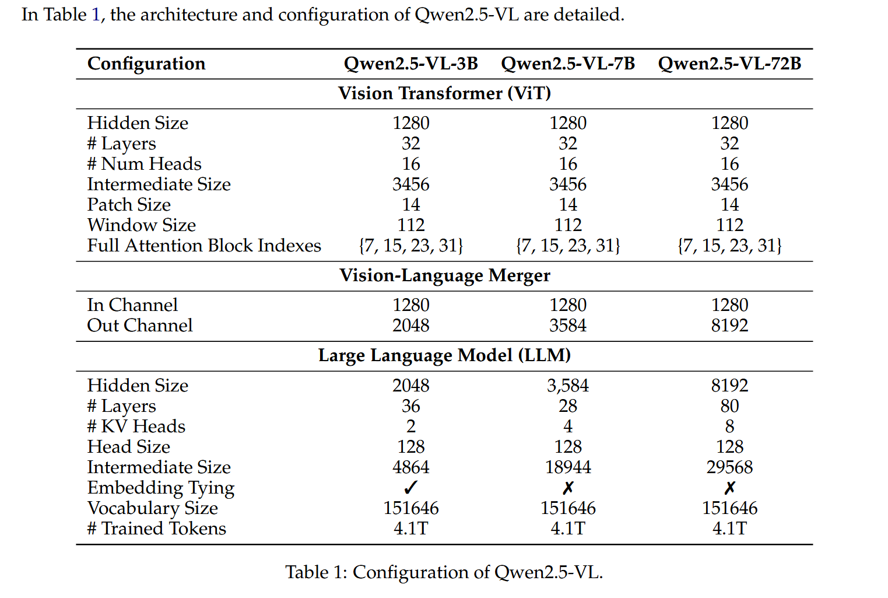
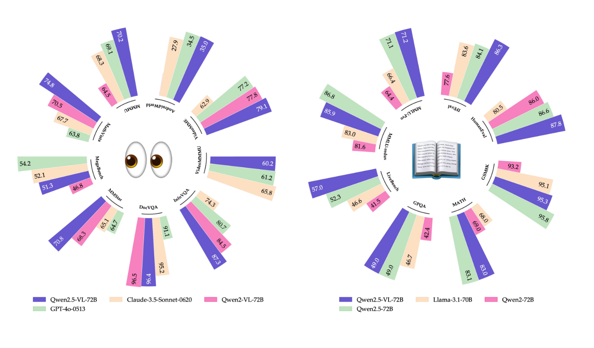

# Note Qwen2.5-VL Technical Report
 
## Introduction
Qwen2.5-VL 有三个版本 ： 72B, 7B, 3B

### What are current LVLMS's main drawbacks ?
- 像 “夹心饼干的中间层” ---- 即夹在视觉和语言大模型之间，什么都能做，但都做得不够好
  
- 细粒度的视觉任务构成了类比中的基础层

### What are Qwen2.5-VL's main advantages ?
- 全能文档解析能力 ：可处理多场景、多语言、多形式（如手写、表格、乐谱等）文档

- 跨格式精准物体定位 ：在 detecting objects, pointing to objects, counting objects 准确性得到提升，且支持绝对坐标与 JSON 格式输出 

- 超长视频理解与细粒度视频定位（在几秒钟内提取事件片段）

- 面向电脑和移动设备的增强性智能体功能

> detect objects : 识别图中有哪些目标
> point to objects : 用点/坐标/框等之处目标具体位置
> count objects : 数有多少个同类物体
> 上述三个任务构成了 "细粒度空间理解" 的核心
> 
> second-level event localization（秒级事件定位）：通常指在"**秒级别**"的时间精度上，对视频中特定事件进行定位（localization 指第几秒开始第几秒结束）的任务

### What innovations are Qwen2.5-Omin ? 

- 视觉编码器 ViT 采用 **window attention** 以优化推理速度，此外将 ViT 中 FFN 整合 **SwiGLU 激活函数**，采用 **RMSNorm 正则化**

- **动态 FPS 采样**，将动态分辨率扩展到时间维度（即动态帧），支持对不同采样率的全面视频理解

- 将时间域上 **MRoPE 与绝对时间对齐**，促进复杂地时间序列学习 
 

> FPS (Frame Per Second) : 每秒中采样多少帧图像
>
> dynamiac FPS Sampling : 根绝视频内容变化动态地调整帧采样频率
>
> RMSNorm (Root Mean Square Normalization) : 层归一化的一种变体
>
> $$ LayerNorm(x) = \frac{x - \mu }{\sigma} * \gamma + \beta $$
>
> $$ RMSNorm(x) = \frac{x}{RMS(x)} * \gamma $$
>
> $$ RMS(x) = \sqrt{\sum_{i=1}^n x_{i}^{2}} $$
>
> SwiGLU 激活函数 ： 由 Gated Linear Units(GLU) 和 Swish 激活函数结合起来，常用于 Transformer 的前馈层 (Feedforward Layer)。相比原始 GLU 中使用的 sigmod，它更 “平滑” 、“非线性强”。 
>
> $$ GLU(x) = (xW_1) * \sigma(xW_2) $$
>
> $$ Swish(x) = x * \sigma(x) $$
>
> $$ SwiGLU(x) = (xW_1) * Swish(xW_2) $$
> 

 

## Model

### Overall Architecture

Qwen2.5-VL 整体上由三部分组成 ：
- Large Language Model : 使用 Qwen2.5 LLM 中预训练权重进行初始化，将 1D-RoPE 修改为与绝对时间对齐的 MRoPE 

- Vision Encoder ：redesigned ViT ，在训练和推理时，都会把输入图像的高和宽调整为 28 的倍数，采用 14 * 14 patch

- MLP-based Vision-Languange Merger : 将空间相邻的 4 个 patch 特征拼接在一起，通过一个两层的 MLP 将其投影与文本嵌入相同的维度。不仅降低了计算成本，而且提供一种灵活的动态压缩不同长度的图像特征序列的方式（个人理解：可按需选择是否压缩）

### Fast and Efficient Vision Encoder

- 仅四层使用全注意力，其余使用 windows attention，maximum window 尺寸为 112 * 112，小于 112 * 112 保留原始分辨率； 

- 对视频数据，将两个连续帧组合在一起，减少 video 的 tokens 数量

- ViT 架构与 LLM 保持一致，采用 RMSNorm 和 SwiGLU

### Native Dynamic Resolution and Frame Rate

for Image : 
- 动态处理不同尺寸图像 

- 直接使用图像的实际尺寸来表示 bounding box、关键点坐标和其他空间特征，使模型自动学习 “尺度信息” （不同于传统的通过归一化坐标来处理空间位置）

for video :
- 采用动态帧训练

- 引入绝对时间编码，使模型通过时间维度上 ID 之间的间隔来理解时间节奏（不同于使用文本事件戳或额外的注意力头来实现事件定位）

> native : 指模型本身结构设计就天然支持，不依赖外部补丁或复杂的预处理模块
>
> textual timestamps（文本时间戳）：以文字形式提供给模型的时间信息，通常使人类刻度的文字描述，而不是像 1.5 秒这种数字型时间戳
>
> 

### Multimodal Rotary Position Embedding Aligned to Absolute Time

**MRoPE in Qwen2-VL** :  将位置编码结构为三部分 : temporal, height, width
  - for text : identical position IDS, 等价于 1D-RoPE 
  - for image : identical temporal IDs, 根据图像块位置分配 height 和 width
  - for video  :
    - video : 看作图像序列，每一帧对应一个 Temporal ,向后递增 1，height、width 与 image 相同
    - 由于视频中帧率不固定，根据实际时间动态调整使得每一个 Temporal ID 对应 40ms

**improve in Qwen2.5-VL** :
- 在 Qwen2-VL 中，MRoPE 中时间位置 ID 仅与输入帧数量相关联，没有考虑内容变化速度或视频中事件发生的绝对时间点

- 将 MRoPE 的时间部分与绝对时间对齐，利用时间 ID 之间的间隔信息，让模型在不同帧采样的视频之间一致的时间对齐方式

## Pre-Training

[预训练数据集构建][1] --> [训练流程与配置][2] 

[1]:https://github.com/yuan-qi5/mllm/blob/main/paper/Qwen2.5-VL.md#pre-training-data
[2]:https://github.com/yuan-qi5/mllm/blob/main/paper/Qwen2.5-VL.md#training-recipe

### Pre-Training Data

- 将预训练数据由 1.2 万亿 token 扩展到大约 4 万亿 token。

- 预训练数据集包含各种不同类型的数据

- 在训练过程调整不同阶段数据类型组成与比例，以优化学习成果

#### Interleaved Image-Text Data :

对多模态学习至关重要

benefits : 
 - 通过同步视觉或文本线索实现上下文学习
 
 - 在图像缺失时保持强大的纯文本功能
 
 - 包含广泛的一般信息

challenges :
- 现存交错数据缺乏有意义的 text-image 联系，

- 噪声高

设计了一套**数据评分**与**清洗流程**，确保只使用高质量、相关性强的交错数据

cleaning pipeline :
- 标准的数据清洗

- 使用内部评估模型的四阶段评分系统

score criteria :
- 纯文本质量 (text-only quality)
- 图片相关性 (image-text relevance)
- 图文互补性 (image-text complementarity)
- 信息密度平衡 (information density blanace)
  
#### Grounding Data with Absolute Position Coordinates

采用原始分辨率训练，认为相对坐标无法有效表示图像中物体的真实大小和位置，而原始分辨率能实现更好地感知

构建了一个全面的数据集 ：
- 包含图像中的目标框(bounding box)，点位标注(points)，指代表达(referring expressions)

- 结合了公开数据集与自有私有数据集

- 采用将数据合成为多种格式（如: XML,JSON, 自定义格式等），copy-paste augmentation ，使通过现有生成模型来生成数据来丰富数据集

> copy-paste : 通过 “复制 + 粘贴” 的方式，把一个图像中的目标粘贴到另一个图像中，制造更多多样化场景
> open-vocabulary detection (开集目标检测) ：传统的目标检测识别固定类别，开集目标检测要求模型能够推理未见过的类别

#### Document Omin-Parsing Data

Qwen2.5-VL 被设计为一个通用模型，具备全面的能力去解析、理解和转换文档。

对于数据，将任何文档的完整信息及布局框信息和插图描述，以标准化和统一的方式整合进 HTML 标签结构中。

> layout analysis（布局分析）：理解页面结构、段落、标题
> 
> text extraction（文本提取）：从文档中提取纯文本
> 
> chart interpretation（图表解析）：分析图表数据并提取相关信息
>
> illustration processing（插图处理）：识别和理解图像、插图等
> 

#### Video Data

- 增强对不同帧率视频理解的鲁棒性 ：训练时动态采样
  
- 增强对长视频理解 ：对超过半个小时视频，构建长视频字幕数据，这些字幕由多个帧的内容综合生成（长视频单个帧信息太稀疏，难以理解整体）

- 对视频时间定位 ：采用两种格式来表示时间戳，基于秒的格式（如：132.5秒），小时-分钟-秒-帧格式（hmsf格式，如 `00:02:12:15`）确保模型能准确理解并生成各种时间格式

#### Agent Data

通过增强模型的 perception 和 decision-making 来构建 Qwen2.5-VL的智能体能力

for perception :  

收集来自移动端、网页端和桌面端的页面截图，并用一个合成数据引擎来自动生成 ：界面截图的描述(captions)和 UI 元素的定位标注(grounding annotations)  
Caption 任务使模型理解界面整体内容，Grounding 任务使模型将界面追踪元素的外观与其功能对齐

for decision-making :  

先将不同平台（如移动端、网页端和桌面端）上操作统一为一个函数调用形式，并定义一个共享的动作空间，
再将一批带有标注的多步操作轨迹重新整理为统一的函数调用格式，
然后通过人工与模型标注员为每一个操作步骤生成对应的推理过程，  

具体来说 :  

截图中高亮标出一个真实操作 --> 向标注员提供全局查询(global query)及操作前后截图 --> 标注员写出操作背后的推理内容 --> 过滤低质量推理内容

> agent capability : 指模型能主动理解任务并执行一步步操作，即：观察界面 --> 分析任务 --> 决策执行
> multi-step trajectory（多步操作轨迹） : 指执行一个任务所需的一系列步骤

### Training Recipe

初始化：

- LLM 使用 pre-trained Qwen2.5-LLM 初始化

- ViT 使用 DataComp 和内部数据集进行初始化

三阶段学习 ：

- stage1 : 仅 ViT 训练，学习与 LLM 对齐，为多模态理解学习坚实的基础

- stage2 : 所有参数解冻，再视觉与语言模式间建立更深级别的联系
 
- stage3 : 增强对长样本的推理能力

为解决不同图像尺寸和文本长度差异带来的**计算负载不平衡**，对 LLM 采用**动态打包**策略
- stage1 & stage2 : 8192 token
- stage3 : 32768 token

> 动态打包(dynamic packing) : 将多个 “短的样本” 打包在一起填满一个最大 token 长度限制，充分利用模型计算资源

## Post-Training

使用 SFT(Supervised Fine-Tuning) 和 DPO(Direct Preference Optimization)

### Training Recipe

- 两阶段都冻结 ViT

- SFT 阶段在多种类型多模态数据上训练

- DPO 阶段在 image-text & pure text 数据上训练 

### SFT data construction

- 数据集组成 ：由 200 万个 entries，一半纯文本数据，一半多模态数据（图像-文本、视频-文本）

- 数据集清理 ：首先使用 Qwen2-VL-Instag 进行分类，分为 8 大类，30个子类；然后针对每一类进行数据清理，主要通过基于启发式规则的清理的基于评分模型的清理 

- 拒绝采样 ：用 “中间模型” 对数据进行初步 “测试”，只保留那些模型输出与标准答案匹配的样本，丢弃其他的，形成一个 “干净可信” 的子集

## Experiments

Qwen2.5-VL-72B 与 GPT-4o 和 Claude 3.5 Sonnet 相当，尤其擅长文档与图标理解。

