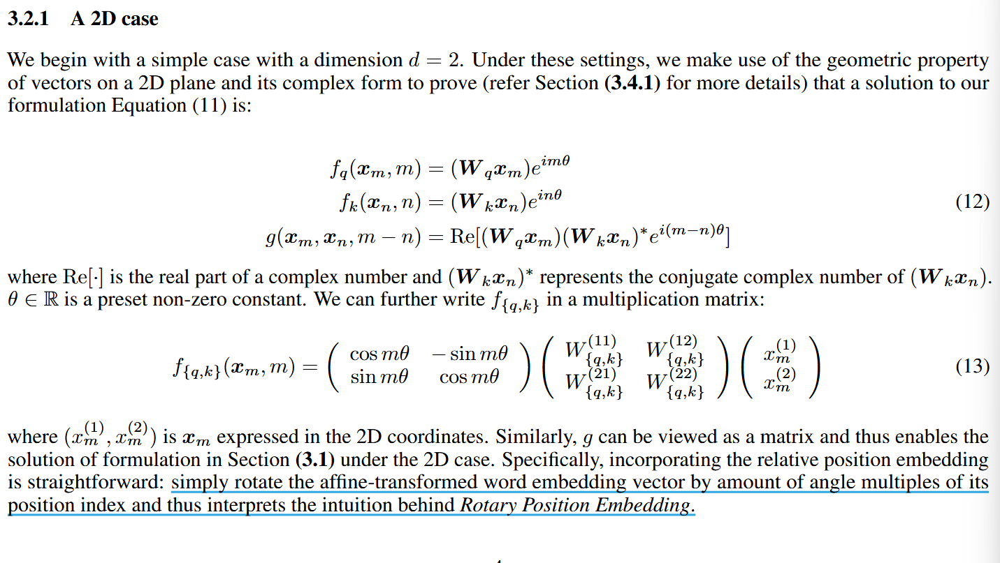
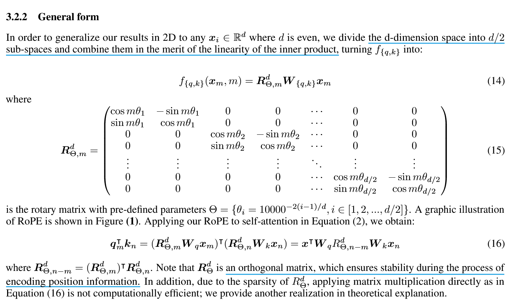
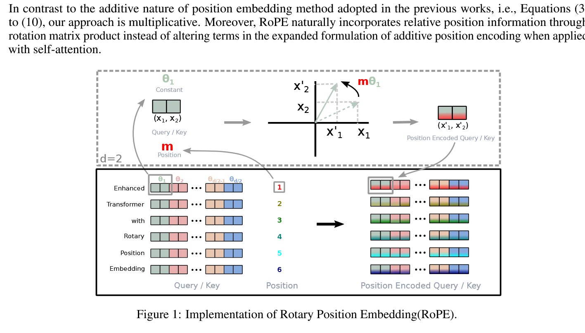
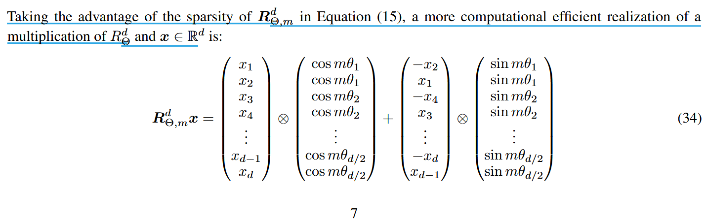
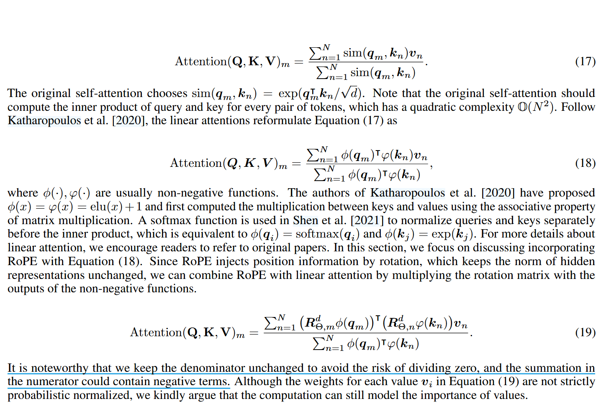

# Roformer: Enhanced Transformer With Rotary  Position Embedding

## Induction

### What is the main content ?

- 研究将位置信息整合进大语言模型学习过程的各种方法

- 提出一种新的方式 —— 旋转位置编码 (Rotary Position Embedding)

  - 用旋转矩阵对绝对位置进行编码，同时将显示相对位置依赖性纳入自注意力公式
 
  - 实现了序列灵活性，随着相对距离的增加而衰减 token 间的依赖关系
 
  - 能够很好地和线性自注意力相结合
    
- 在各种长文本分类基准数据集上进行了评估，并对部分实验结果进行了理论分析

## Method

### Formulate the relative position

希望得到函数 g 去编码 $q_m$ 和 $k_n$ 的相对位置信息

 $$ < f_q(x_m, m), f_k(x_k,n) > = g(x_m,x_n,m-n) $$

### Derive RoPE

**A 2D case** 

**General form**

**Efficient implementation**

### Investigate property

**Long-term decay** ： 

**RoPE with linear attention**

