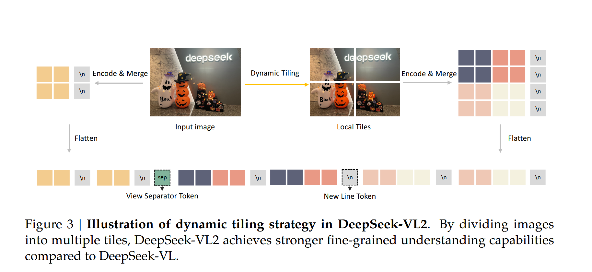
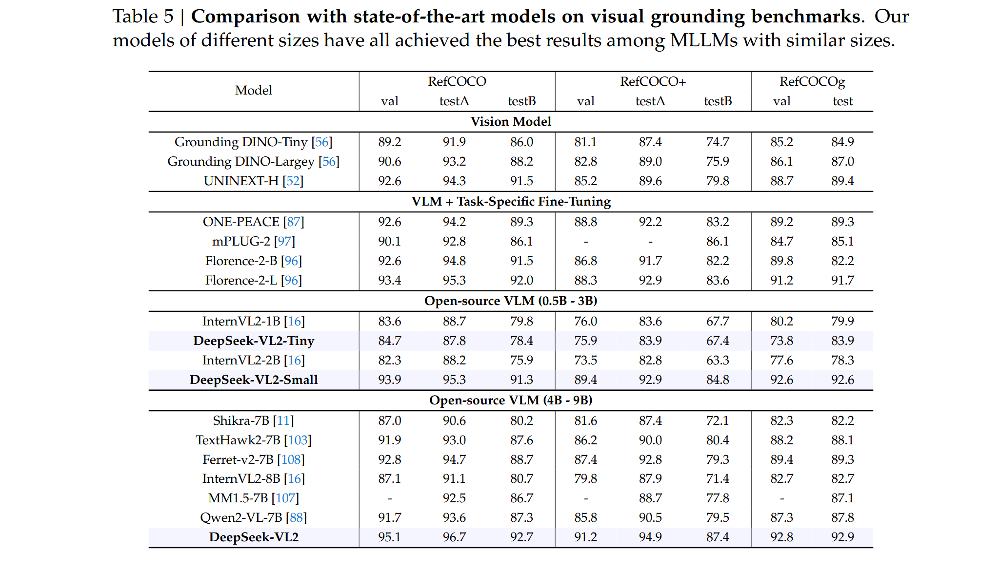

# Note : DeepSeek-VL2：Mixture-of-Experts Vision-Language Models for Advanced Multimodal Understanding 

## Introduction

### What advancements are DeepSeek-VL2 ?

- a dynamic, high-resolution vision encoding strategy

  - a dynamic tiling vision encoding , 类似 slicing-tile methods , 高分辨率图像分块，再通过共享参数的 ViT 处理 与 DeepSeek-VL 的混合视觉编码（以两种固定分辨率 384 * 384，1024 * 1024）相比，可处理不同纵横比的高分辨率图像
    
- an optimized language model architecture

  - 利用 Multi-head Latenet Attention(MLA) 机制，通过压缩 KV cache 极大减少计算消耗
 
  - 使用 DeepSeekMoE framework 提高效率，采用三种 MoE 变体，3B、16B、27B，对应 0.57B、2.4B、4.1B 的激活参数
    
- a refined vision-language construction pipeline

  - 改进后数据集新增视觉 grounding 和图形用户界面感知功能
    

> llava-style architecture :
>
> 

## Model Architecture

DeepSeek-VL2's core components :

- a vision encoder

- a vision-language adaptor

- a Mixture-of-Experts language model

### Dynamic Tiling Strategy

pre-trained SigLIP-SO400M-384 要求输入图像尺寸为 384 *384

处理方式 :

- 定义一个候选尺寸集 CR，将图像分为多个 $384 \times 384$ 的小 "tile"
 
CR = { (m × 384, n × 384) | m ∈ ℕ, n ∈ ℕ, 1 ≤ m, n, mn ≤ 9 }

- 先调整长边与目标分辨率一致（保持宽高比），再填充另一边，以填充区域最小来选择切割方式

- 将切割后的 tile 以及全局缩略图(global thumbnail tile)输入视觉编码器处理（每个 tile 输出 $27 \times 27$ 个 token）

- 如果一次输入多张图，不再使用动态 tile 策略，

  

### Vision-Language Adaptor

- 先使用 $2 \times 2$ pixel shuffle 将 $27 \times 27$ 压缩为 $14 \times 14$ tokens

- 引入三个特殊 token，在全局缩略图每行后加一个 <tile_newline>，将 $m_i \times n_i$ 局部 tile 重排成形状为( $m_i \times 14$, $n_i \times 14$ ) 2D 网格，在最后一列末尾加上 $m_i \times 14$个 <title_newline>，展平后再在全局缩率图与 local tiles 间插入一个 <view_separatir>

- 使用两层 MLP 将其投影到语言模型的嵌入空间

> pixel shuffle (像素重排操作) ：将特征图的通道维度重排为空间维度（或反过来）的操作。
>

### DeepSeekMoE LLM

- 利用 Multi-head Latenet Attention(MLA) 机制，通过压缩 KV cache 极大减少计算消耗
 
- 使用 DeepSeekMoE framework 提高效率，在 MoE 训练阶段，为每位专家引入全局偏差以解决负载平衡

> load imbalance : 是 MoE 中的一个经典问题，在 MoE 中，每个样本由一个 “门控网络” 决定走哪个 expert, 有时会出现部分 expert 经常被使用，部分 expert 几乎闲置，这会导致训练不充分、容易过拟合以及计算资源浪费等问题

## Data Construction

训练过程分为三个阶段 ：

- VL alignment

- VL pretraining

- supervised fine-tuning 

### Vision-Language Alignment Data

使用 ShareGPT4V 数据集，大约包含 1.2M 字幕与对话样本

### Vision-Language Pretraining Data

包含 70% 的 visual-language data 和 30% 的 text-only data

text-only data 来自 deepseek 基础的 LLM pre-training 语料库

VL data : 

- interleaved inmage-text data : WiT, WikiHow, 30% random samples from OBELICS, 这个特定的混合比例是通过 DeepSeek-VL2-Tiny 的初步实验确定的。额外补充了中文内容数据集和内部数据集。

- image captioning data : Images captions 是 VLM 中的基础数据，提供视觉-文本信息之间的直接对齐。因为现有数据集
-   - 存在严重的质量差异，开发了一个 image caption pipeline ，综合考虑 (1) OCR 提示 (2)原信息（如位置，相机位置等）(3) 相关的原始字幕作为 prompt ，在重新进行字幕生成
    - 存在重复问题 ： 使用 Deepseek-Chat 进行评分来过滤筛选
      
- optical character recognition data : 使用 LateX OCR 和 12M RenderedText 及集中于中英文字符识别的内部数据集

- visual question-answering(QA) data : 发现 general QA data 有利于模型的预训练，故开发了一个综合视觉 QA 数据集 ：
-   - general VQA : 使用来在 Deepseek-VL 的 general VQA data
    - tabel and chart understanding : 使用 PubTabNet, FinTabNet，Docmatix
    - web-to-code and plot-to-python generation : 利用 Websight 数据集和 Jupter Notebook 中公开的绘图代码来增强网页转代码能力，同时利用 DeepSeek-V2.5 对 Websight 中部分样本进行复制增强和自动生成的绘图代码来减少原始图转代码数据中的噪声
    - QA with visual prompt : 将视觉指标（箭头、方框、圆圈和涂鸦）叠加到图像上，再创建 QA 对来构建数据提示理解数据

- visual grounding data :  将开源数据集中数据结构化，在训练时 question prompts 随机选择，<|ref|>、<|/ref|>、<|det|>、<|/det|>是特殊 token，<query> 是类别名臣或对象描述，$[[x_1, y_1, x_2, y_2], ... ]$是边界框列表，每个边界框对应于对象的位置。额外构建了负样本，即查询图像中没有的对象，以增强鲁棒性

- grounded conversation data :

### Supervised Fine-tuning Data

> 没有额外说明即代表与预训练基本一致

- general visual question-answering : 使用重新生成 response ，来解决公共视觉 QA 数据集的三个主要限制 ：(1) 简短的响应 (2) OCR质量差(3) 幻觉内容。 此外观察到在 DeepSeek-VL2-Tiny 的早期阶段，偶尔会在中文回复中不恰当地插入英文单词，但在大型模型中不存在，表明它是由有限的模型容量以及视觉语言预训练中英文和中文数据不平衡造成的，为此开发了一个内部中文 QA 数据集来缓解语言混合问题。

- OCR and document understanding : 与预训练一样，额外增加了删除质量较差数据去清理数据集。对文档理解，发现先选择一些文档页面子集再生成多轮会话 QA 对可改进交互。

- table and chart understanding

- reasoning, logic, and mathematics :  加入更详细的推理过程来增强公共推理数据集，并且标准化回答格式，使得最终答案出现再回答末尾。此外观察到，在训练较小的 VLMs （如 DeepSeek-VL2-Tiny），详细的回答效果较差，简洁的回答表现更好

- textbook and academic questions

- visual grounding

- grounded conversation

- text-only datasets

## Training Methodology

### Vision-Language Alignment

冻结语言模型，训练视觉编码器和视觉语言适配器，为对齐视觉特征与语言特征

### Vision-Language Pre-training

解冻所有参数，使用大约 800B image-text tokens 进行训练，增强多模态理解能力同时尽量保持语言能力

### Supervised Fine-Tuning

优化所有参数通过 SFT 提升模型的指令跟随(instruction-following)能力和对话(conversational)能力

### Hyperparameters and Infrastructures

DeepSeek-VL2 训练与评估均使用 HAI-LLM，训练过程分别用了 7/10/14 天使用 16/33/42 个节点，每个节点有 8 张 A100。

## Evaluation 

> 不包含所有内容，详细信息请阅读原文

在开源模型上表现不错，但与闭源模型仍然存在一定的差距。

visual grounding ：训练集中大部分图像来自自然场景，但可以泛化到其他场景（如动漫等），并具有识别名人和抽象概念的能力

